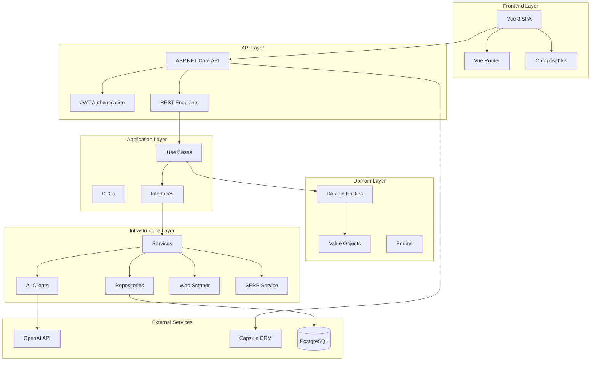
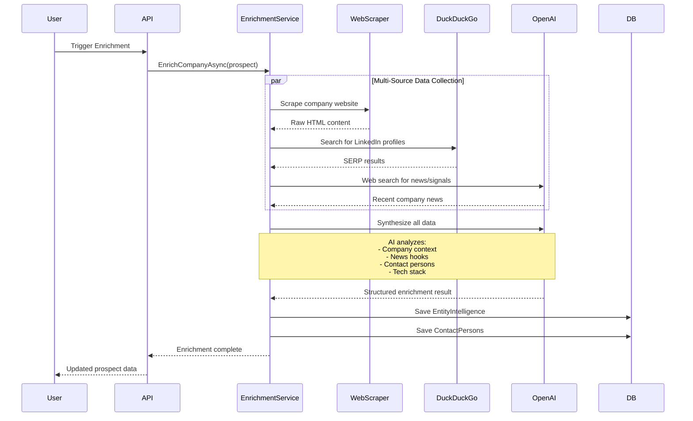
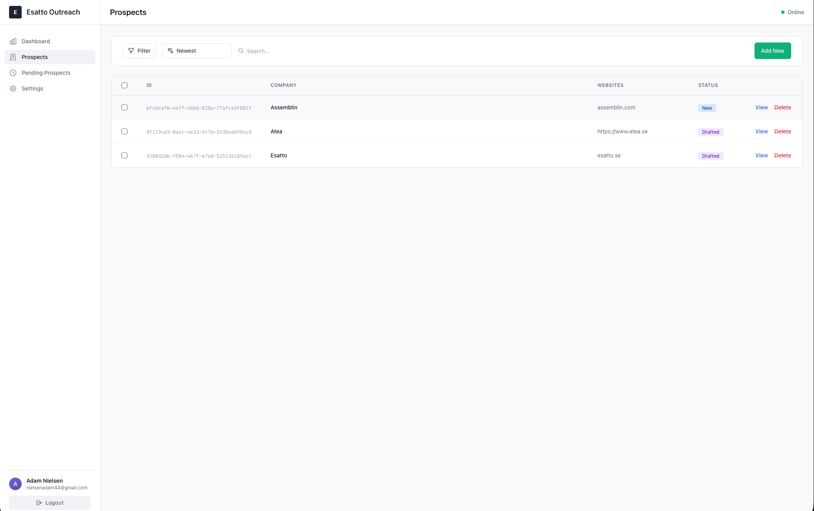
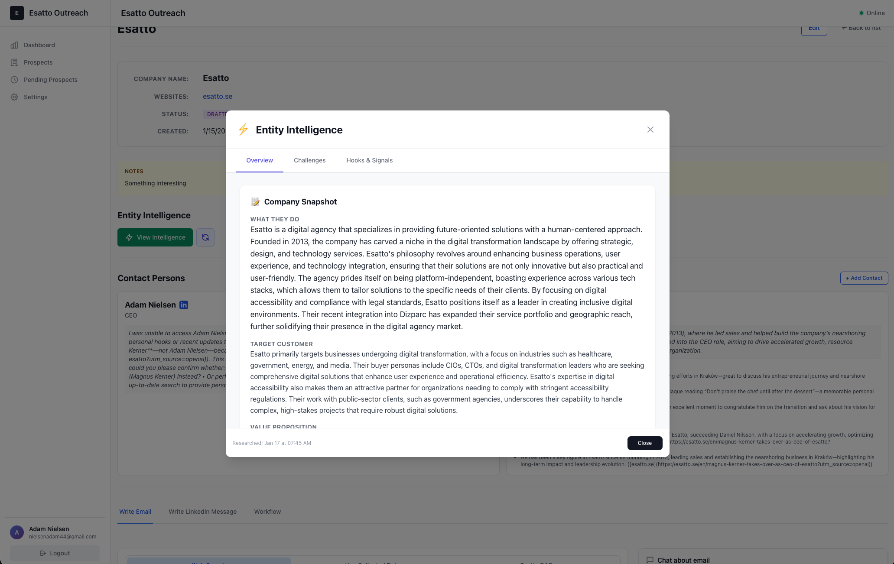
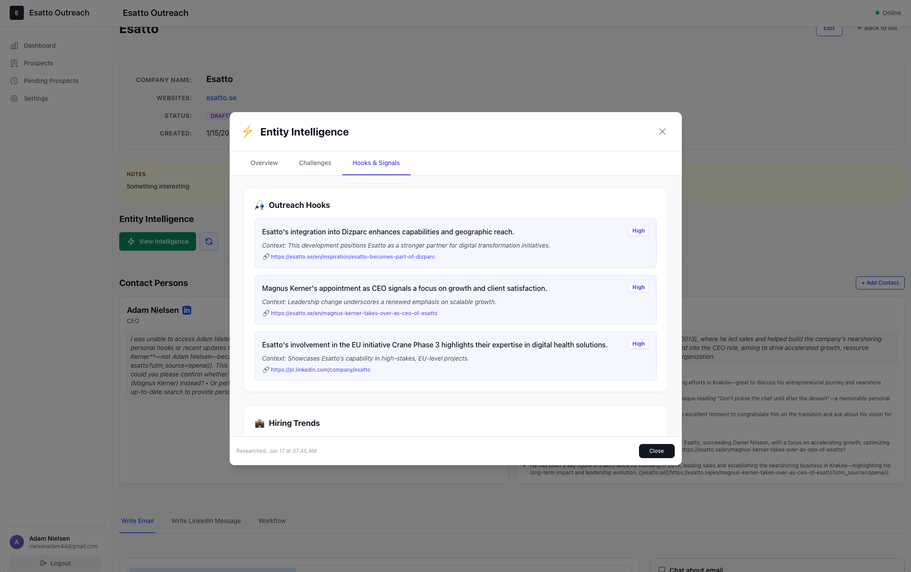
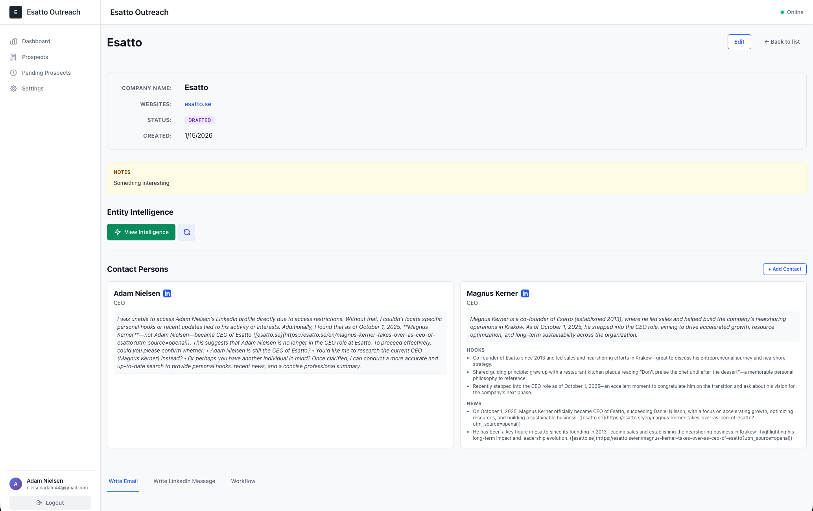
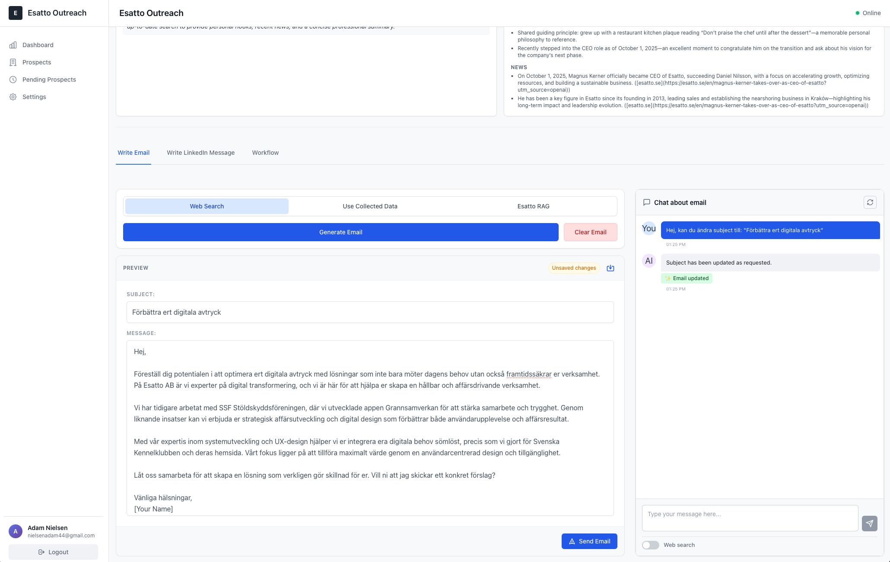
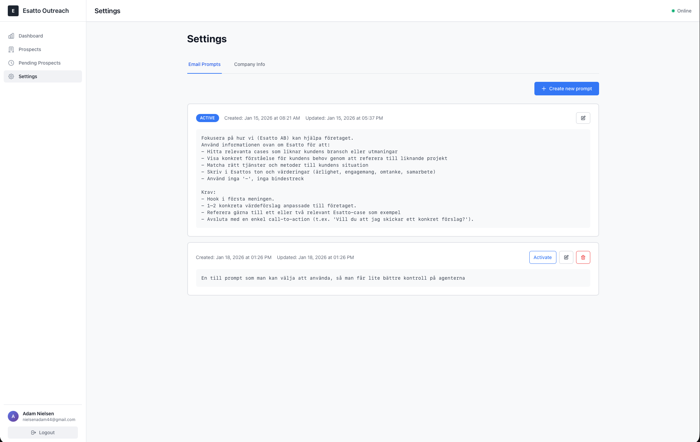

# Esatto Outreach

> **AI-Powered Sales Intelligence & Multi-Channel Outreach Automation**

Esatto Outreach is a comprehensive sales automation platform that discovers prospects with buying signals, enriches them with deep company and contact intelligence, and orchestrates personalized multi-channel outreach campaigns—all powered by AI.


---

## 🎯 What is Esatto Outreach?

Esatto Outreach is a full-fledged sales automation system designed to handle the entire outreach lifecycle:

1. **Prospect Discovery** - Identify companies with buying signals
2. **Deep Enrichment** - AI-powered research on companies and decision-makers
3. **Intelligent Outreach** - Multi-channel campaigns (LinkedIn, Email) with AI-generated personalization
4. **Workflow Automation** - Customizable sequences with smart timing
5. **AI Assistant** - Real-time email refinement and chat-based modifications

Unlike traditional sales tools that rely on static databases, Esatto Outreach acts as an **AI research assistant** that actively discovers and synthesizes information from the web, creating hyper-personalized outreach at scale.

---

## 🏗️ Architecture Overview

Esatto Outreach follows a clean architecture pattern with clear separation of concerns:



### Core Components

#### **Domain Layer**
- `Prospect` - Central entity representing a target company
- `ContactPerson` - Decision-makers at target companies
- `EntityIntelligence` - AI-generated company research and insights
- `HardCompanyData` - Structured company information (industry, size, etc.)

#### **Infrastructure Services**
- **CompanyEnrichmentService** - Orchestrates multi-source data collection
- **CompanyKnowledgeBaseService** - RAG-based company knowledge storage
- **HybridContactDiscoveryProvider** - Multi-strategy contact finding
- **WebScraperService** - Deep website content extraction
- **DuckDuckGoSerpService** - Search engine results parsing
- **OpenAIChatService** - Conversational AI for email refinement

#### **Data Sources**
- Capsule CRM (webhook integration)
- Web scraping (company websites)
- DuckDuckGo SERP (LinkedIn profile discovery)
- OpenAI Web Search (supplementary research)

---

## 🚀 Key Features

### ✅ Production Features

#### **1. Prospect Management**
- **Capsule CRM Integration** - Automatic webhook-based prospect sync
- **Manual Prospect Creation** - Add companies directly to the system
- **Claim Workflow** - First-come-first-served assignment for team collaboration
- **Status Tracking** - New → Researching → Ready → Contacted

#### **2. AI-Powered Enrichment**
The enrichment engine is **continuously evolving** to improve quality and efficiency.

**Current Capabilities:**
- **Company Intelligence**
  - Value proposition analysis
  - Target audience identification
  - Tech stack detection
  - Recent news and signals (hiring, funding, product launches)
  - Strategic priorities and pain points

- **Contact Discovery** (Hybrid Approach)
  - Website scraping for team pages
  - DuckDuckGo SERP for LinkedIn profiles
  - OpenAI web search for supplementary data
  - AI-powered deduplication and ranking (0-100 confidence score)

- **Structured Data Storage**
  - JSON-based enrichment results
  - Version tracking for research iterations
  - Staleness detection (auto-refresh after 14 days)

#### **3. AI Email Generation**
- Context-aware email drafting using enrichment data
- Multiple tone options (professional, casual, technical)
- Real-time AI chat for email modifications
- Subject line generation
- Plain text and HTML output

#### **4. Live AI Chat Assistant**
- **Already Implemented** ✅
- Modify emails in real-time through conversation
- Context-aware suggestions based on prospect data
- Maintains conversation history per prospect

#### **5. User Authentication**
- JWT-based authentication
- Refresh token rotation
- User-specific prospect ownership

---

### 🧪 Experimental Features

> [!WARNING]
> These features are in early development and may change significantly.

#### **RAG + Fine-Tuning Integration**
- Knowledge base construction from enrichment data
- Vector-based similarity search for context retrieval
- Experimental prompt optimization

---

### 📋 Planned Features

> [!NOTE]
> Roadmap items currently in design/development.

#### **Workflow Builder**
A visual workflow designer for multi-channel outreach sequences:

**Example Workflow:**
1. **LinkedIn Follow** → Wait 2 days
2. **Personalized Email** → Wait 5 days
3. **LinkedIn Message** → Wait 7 days
4. **Follow-up Email**

**Features:**
- Drag-and-drop workflow editor
- Custom timing rules
- Conditional branching (e.g., "if email opened, send follow-up")
- Default templates + custom workflows
- Multi-channel support (LinkedIn, Email, Phone)

---

## 🔄 Enrichment Workflow

The enrichment process is the heart of Esatto Outreach. Here's how it works:



### Data Flow

1. **Input**: Company name or domain
2. **Collection Phase** (parallel):
   - Website scraping (homepage, about, services, team pages)
   - DuckDuckGo SERP scraping (LinkedIn profiles)
   - OpenAI web search (news, press releases)
3. **Synthesis Phase**:
   - AI analyzes all collected data
   - Extracts structured information
   - Identifies decision-makers
   - Generates personalization hooks
4. **Storage Phase**:
   - Save `EntityIntelligence` (company research)
   - Create `ContactPerson` records
   - Link to `Prospect` entity
5. **Output**: Enriched prospect ready for outreach

---

## 🛠️ Tech Stack

### Backend
- **.NET 8** - Modern C# with minimal APIs
- **ASP.NET Core** - RESTful API framework
- **Entity Framework Core** - ORM with PostgreSQL provider
- **PostgreSQL** - Primary database
- **OpenAI API** - GPT-4 for enrichment and chat
- **JWT Authentication** - Secure user sessions

### Frontend
- **Vue 3** - Progressive JavaScript framework
- **TypeScript** - Type-safe development
- **Vite** - Lightning-fast build tool
- **Tailwind CSS** - Utility-first styling
- **Vue Router** - Client-side routing
- **Axios** - HTTP client
- **Heroicons** - Beautiful SVG icons

### Infrastructure
- **Azure** - Cloud hosting
- **Capsule CRM** - CRM integration (webhook-based)

---

## 📁 Project Structure

```
esatto-project-outreach/
├── esatto-outreach/                    # Backend (.NET)
│   ├── Esatto.Outreach.Api/           # API layer (endpoints, auth)
│   ├── Esatto.Outreach.Application/   # Use cases, DTOs, abstractions
│   ├── Esatto.Outreach.Domain/        # Domain entities, value objects
│   ├── Esatto.Outreach.Infrastructure/# Services, repositories, DB
│   └── Esatto.Outreach.Debug/         # Development utilities
│
├── esatto-outreach-frontend/          # Frontend (Vue 3)
│   ├── src/
│   │   ├── components/                # Reusable UI components
│   │   ├── views/                     # Page-level components
│   │   ├── composables/               # Vue composition functions
│   │   ├── services/                  # API client services
│   │   ├── types/                     # TypeScript type definitions
│   │   └── router/                    # Route configuration
│   └── public/                        # Static assets
│
└── .agent/                            # AI agent workflows
```

### Key Modules

#### **Application Layer**
- `UseCases/Prospects/` - Prospect CRUD operations
- `UseCases/EmailGeneration/` - AI email generation
- `UseCases/Chat/` - AI chat interactions
- `UseCases/SoftDataCollection/` - Enrichment orchestration

#### **Infrastructure Layer**
- `Services/Enrichment/` - Company and contact enrichment
- `Services/Scraping/` - Web scraping and SERP parsing
- `EmailGeneration/` - Email template rendering
- `Repositories/` - Data access layer

---

## 🎨 User Interface

### Dashboard

*Overview of prospects, enrichment status, and recent activity*

### Prospect Detail - Enrichment Overview

*Comprehensive view of enriched company data including value proposition, target audience, tech stack, and strategic priorities*

### Enrichment - Personalization Hooks

*AI-discovered news, hiring signals, and personalization hooks for outreach*

### Contact Persons Discovery

*AI-powered contact discovery with confidence scores and enrichment status*

### Email Editor with AI Chat

*AI-powered email generation with live chat assistant for real-time modifications*

### Customizable AI Prompts

*Configure and customize AI prompts for email generation and enrichment*

---

## 🔌 API Overview

### Authentication
```http
POST /api/auth/register
POST /api/auth/login
POST /api/auth/refresh
```

### Prospects
```http
GET    /api/prospects              # List all prospects
GET    /api/prospects/{id}         # Get prospect details
POST   /api/prospects              # Create manual prospect
PUT    /api/prospects/{id}         # Update prospect
DELETE /api/prospects/{id}         # Delete prospect
POST   /api/prospects/{id}/claim   # Claim pending prospect
```

### Enrichment
```http
POST /api/prospects/{id}/enrich                    # Trigger company enrichment
POST /api/prospects/{id}/contacts/{contactId}/enrich  # Enrich contact person
```

### Email Generation
```http
POST /api/prospects/{id}/generate-email   # Generate AI email
```

### AI Chat
```http
POST /api/chat/send                       # Send chat message
GET  /api/chat/history/{prospectId}       # Get chat history
```

### Capsule CRM Integration
```http
POST /api/capsule/webhook                 # Capsule webhook endpoint
```

---

## ⚠️ Known Limitations

> [!IMPORTANT]
> Esatto Outreach is in **alpha** stage. Expect bugs and breaking changes.

### Current Issues

1. **LinkedIn Integration**
   - Direct LinkedIn integration not yet implemented
   - Currently relies on SERP scraping (less reliable)
   - Exploring official LinkedIn API and alternative approaches

2. **News Recency**
   - News results sometimes include outdated articles (>4 months old)
   - AI filtering needs improvement to enforce recency constraints

3. **Enrichment Quality**
   - LLM hallucination risks (AI may infer incorrect information)
   - Continuous prompt engineering to improve accuracy
   - Manual verification recommended for high-value prospects

4. **Cost Considerations**
   - Multiple GPT-4 API calls per enrichment (can be expensive at scale)
   - Web scraping and SERP requests add latency
   - Recommended for high-ticket B2B sales where cost-per-lead is justified

5. **Rate Limiting**
   - DuckDuckGo SERP scraping may trigger rate limits
   - OpenAI API rate limits apply
   - No built-in retry logic yet (planned)

---


## 📊 Project Status

**Current State:** Alpha (Early Development)

- ✅ Core enrichment pipeline functional
- ✅ AI email generation working
- ✅ Basic UI complete
- 🚧 LinkedIn integration in progress
- 🚧 Workflow builder in design
- 🚧 Production deployment optimization

**Deployment:** Azure (development environment)

**Use Case:** Currently custom-built for Esatto's internal sales team, with potential to evolve into a standalone product.

---


**Note:** This project is under active development. Features, architecture, and documentation are subject to change.
